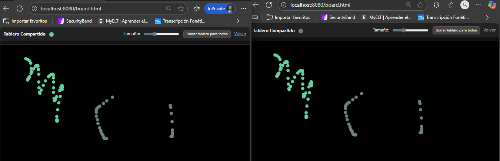

# Tarea: Tablero colaborativo

- Stack: Java 21, Spring Boot 3.x, Maven, React 16 (CDN y Babel solo en desarrollo), P5.js

- Paquete base: edu.eci.arsw

 - Objetivo: demostrar integración de:

   - React (JSX y componentes) sirviendo estáticos desde Spring Boot

   - Manejo de sesión HTTP en el backend

   - Tablero colaborativo con P5 que sincroniza trazos entre usuarios mediante REST y polling

## Cómo ejecutar 

- Requisitos previos:

  - Java 21

  - Maven 3.9+

- Comandos:

  - En la carpeta del proyecto: mvn spring-boot:run

- URL principales:

  - React y estado del servidor: http://localhost:8080/index.html

  - Tablero colaborativo con p5: http://localhost:8080/board.html

- Empaquetar JAR (opcional):

  - mvn clean package: genera target/react-p5-board-1.0.0.jar

  - Ejecutar: java -jar target/react-p5-board-1.0.0.jar

## ¿En qué consiste?

- Arquitectura general:

  - Spring Boot expone endpoints REST y sirve recursos estáticos desde src/main/resources/static.

  - El frontend está compuesto por páginas HTML simples que cargan React (por CDN) y P5.js (por CDN).

  - El tablero colaborativo usa un ciclo de polling para traer del servidor los trazos acumulados y redibujarlos para todos.

- Flujo funcional (rápido):

  - En index.html:

    - Guardas tu nombre con /setname?name=... (se almacena en la sesión).

    - Un componente React (StatusComponent) consulta periódicamente /status y muestra el mensaje con tu nombre y fecha/hora.

 - En board.html:

    - Al arrastrar el mouse, se envía un “stroke” (x, y, tamaño, color) al backend.

   - Un temporizador hace polling a /api/board para traer toda la lista de trazos y redibujarla.

   - El botón Borrar llama a /api/board/clear y limpia el tablero para todos.

## Qué incluye (archivos y responsabilidad)

- Backend (Java, paquete edu.eci.arsw):

  - WebSiteController.java

    - main(...): arranca Spring Boot.

    - GET /status: retorna un JSON con el mensaje “Greetings…”, la fecha/hora y el nombre guardado en sesión.

    - GET /setname?name=...: guarda el nombre en la sesión HTTP.

    - Uso de sesión: se inyecta HttpServletRequest con @Resource (Jakarta) y se accede a request.getSession().

 - BoardService.java

   - Estructura en memoria que guarda la lista global de trazos (CopyOnWriteArrayList<Stroke>).

   - Métodos:

     - getStrokesSnapshot(): retorna una copia inmutable de los trazos.

     - addStroke(Stroke s): añade un trazo.

     - clear(): borra todo.

  - BoardController.java

     - GET /api/board: retorna { strokes: [...], color: "#RRGGBB" }.

       - El color se calcula por sesión (hash del sessionId) para distinguir usuarios.

    - POST /api/board/stroke: recibe un Stroke en JSON y lo agrega.

    - POST /api/board/clear: vacía el tablero.

    - Nota: se inyecta HttpServletRequest con @Resource (Jakarta) para leer la sesión y asignar color.

   -Stroke.java

   - Record Java con la forma de un trazo: x, y, size, color.

- Frontend (estáticos en src/main/resources/static):

  - index.html

    - Carga React 16 (UMD) y Babel (solo desarrollo).

    - Tiene un input para guardar el nombre en sesión llamando a /setname.

    - Renderiza el Hello World básico y el StatusComponent.

  - js/FirstComponent.jsx

    - Ejemplo mínimo de JSX: renderiza “Hello, world!” en el contenedor #root.

  - js/StatusComponent.jsx

    - Componente React “avanzado”:

      - Estado local: error, isLoaded, status.

      - componentDidMount() programa un setInterval para llamar a /status cada 2 segundos.

      - Renderiza “Loading…”, o “Error…”, o el texto de status según corresponda.

 - board.html

   - Página con la barra superior, controles (tamaño de pincel, botón Borrar) y el contenedor del lienzo.

   - Carga P5.js (0.7.1) y el script js/sketch.js.

 - js/sketch.js (P5.js)

   - setup():

     - Crea el canvas.

     - Llama a GET /api/board para:

       - Obtener color único de usuario (derivado de la sesión).

       - Obtener trazos iniciales y dibujarlos.

   - Programa un polling con setInterval(pollBoard, 900) para refrescar el tablero.

 - mouseDragged():

    - Dibuja localmente un círculo (el stroke).

   - Envía el stroke al backend con POST /api/board/stroke.

 - pollBoard():

   - Llama a GET /api/board y redibuja todo (drawAll).

- clearBoard() (botón Borrar):

  - Llama a POST /api/board/clear y limpia el lienzo.

## Ejercicios del PDF y cómo se resolvieron

- Hello React (JSX y ReactDOM.render):

  - Implementado en js/FirstComponent.jsx, cargado desde index.html usando Babel (solo para desarrollo).

- Componente que consulta el backend periódicamente:

  - js/StatusComponent.jsx llama a /status cada 2 segundos, maneja loading/error y muestra el resultado.

- Controlador con manejo de sesión (Jakarta) y mensaje de estado:

  - WebSiteController.java:

   - @GetMapping("/setname") guarda el nombre en la sesión.

  - @GetMapping("/status") lo incluye en el mensaje retornado.

- Tablero colaborativo con P5.js y ayuda de polling:

  - board.html + js/sketch.js + BoardController/BoardService:

   - usuarios dibujan y ven los trazos de otros.

   - Color único por usuario (según sessionId).

   - Botón de Borrar sincronizado para todos.

## Estructura del proyecto 

- pom.xml

  - Define Spring Boot 3.x, Java 21 y spring-boot-starter-web.

  - maven-compiler-plugin con <release>21</release>.

- src/main/java/edu/eci/arsw/

  - WebSiteController.java (aplicación + endpoints /status, /setname)

  - BoardController.java (REST del tablero)

  - BoardService.java (estado en memoria)

  - Stroke.java (record de datos)
-  src/main/resources/static/

   - index.html (React + demos)

    - board.html (P5.js)

   - css/board.css (estilos del tablero)

   - js/FirstComponent.jsx (Hello World)

   - js/StatusComponent.jsx (consulta periódica)

   - js/sketch.js (lógica P5.js del tablero)

## Explicación del código 

- React por CDN y Babel:

  - Facilita probar JSX sin un proceso de build. Es el enfoque didáctico del PDF.

  - En producción conviene usar Vite/CRA para transpilar y optimizar.

- Sesión con jakarta.annotation.Resource + HttpServletRequest:

  - Desde Spring Boot 3, Jakarta reemplaza a javax.

  - request.getSession() permite asociar un nombre y derivar un color estable por usuario.

- Estado del tablero en memoria:

  - CopyOnWriteArrayList es simple y seguro en concurrencia para este caso didáctico.

  - Para producción: persistencia (Redis/DB) y/o WebSockets/SSE para “tiempo real”.

- Polling cada ~900 ms:

  - Más sencillo que WebSockets y suficiente para este laboratorio.

  - La página vuelve a pintar todos los trazos en cada ciclo, garantizando consistencia.

## Cómo probar rápidamente

- En index.html:

  - Escribe tu nombre → pulsa “Guardar” (llama a /setname).

  - Observa “Estado del servidor”: StatusComponent muestra el mensaje con tu nombre y fecha/hora.

- En board.html:

  - Abre dos navegadores (o normal y incógnito).

  - Dibuja en uno y verifica que el otro lo ve casi de inmediato.

  - Pulsa Borrar y confirma que ambos lienzos se limpian.

  - Observa el círculo de color junto al título: es tu color único de sesión.

## Solución de problemas (FAQ corto)

- Error de compilación con javax.annotation.Resource:

  - Usa jakarta.annotation.Resource (ya está corregido en el código).

- Puerto 8080 ocupado:

  - Cierra procesos que usen 8080 o ejecuta el JAR con --server.port=8081.

- No carga React/JSX:

  - Asegúrate de no bloquear CDNs; Babel y React se cargan por internet.

  - Verifica que abres index.html desde http://localhost:8080/index.html (no como archivo local).

- El tablero no sincroniza:

  - Revisa la consola del navegador (errores de red).

  - Confirma que el backend está corriendo y responde GET /api/board.

## Decisiones técnicas 

- Spring Boot 3 y Java 21: moderno, compatible y sencillo de correr con Maven.

-  React y Babel en desarrollo: igual al enfoque del PDF; rápido para demostrar JSX.

- Polling vs WebSockets: se eligió polling para claridad didáctica y menor complejidad.

- Estado en memoria: suficiente para el taller; escalable reemplazándolo por almacenamiento compartido.

## Ejemplo funcionamiento:

## Despliegue en:

tablero-e7dxdsh7e0fjemaw.canadacentral-01.azurewebsites.net